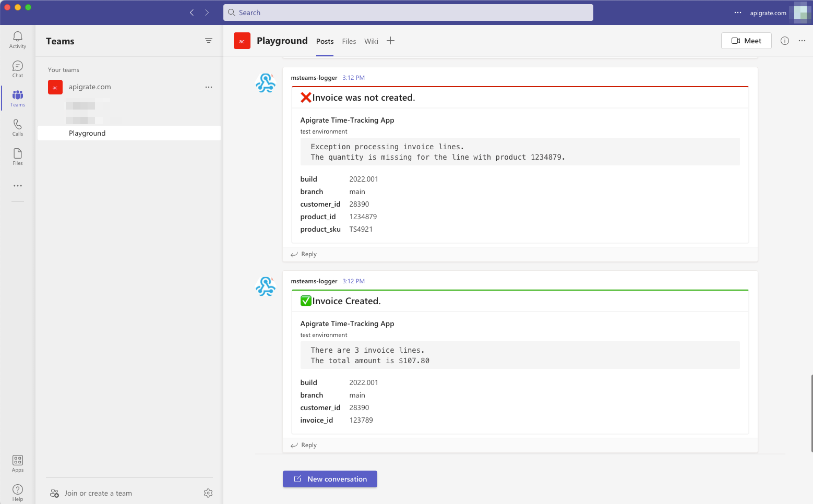

# msteams-logger
A simple utility to post messages to Microsoft Teams using inbound webhooks. For integrators, this is useful for logging transactions to a user-monitored channel where others can see the messages and take action if needed.

## Usage

### Instantiation
```javascript
var webhook = 'your inbound webhook here';

var logger = new MSTeamsLogger(webhook,
  "test environment",
  "Apigrate Time-Tracking App"
);
```
In the above simple example, the username for **each MS Teams message** will be set to  `test environment` and the application_name will be `Apigrate Time-Tracking App`. 

> By convention, *username* is often used to store environment or host name and *application_name* is used to identify the name of the app making the logging call from that environment. You are, of course, free to implement your own conventions.

Here is a more detailed instantiation that includes additional information to be recorded on every logging call.
```javascript
var webhook = 'your inbound webhook here';

var logger = new MSTeamsLogger(webhook,
  "test environment",
  "Apigrate Time-Tracking App",
  {
    fields: {
      build: "2022.001",
      branch: "main"
    }
  }
);
```
In this case, `build` and `branch` fields will be added to **every** log entry produced by the logger instance. 

### Logging
Each log message **must** have the following parameters:

1. true/false indicating success or failure
1. the log message (i.e. a summary)
1. a more detailed message (optional). This could be log details, stack trace or other detailed information for the message (typically more useful to provide troubleshooting info on errors).


Here's how to post a simple "success" message.
```javascript
logger.log(
  true,
  'That worked.'
);
```

It is possible include more detail in log messages. Provide a more detailed message (up to 7500 characters) if you like. Note that this detailed message will be formatted in fixed-font code block immediately following the summary message for readability (newline characters are respected by Slack in the formatting). Additionally, the fields parameter allows you to specify additional data that may be helpful for reporting or troubleshooting **on specific log messages**.
```javascript
logger.log(
  true,
  'Invoice Created.',
  'Found customer.\nThere are 3 invoice lines.\nThe total amount is $107.80',
  {
    customer_id: 28390,
    invoice_id: 123789
  }
);
```

Error log messages (as shown below) are more useful when they include detailed information to allow consumers to troubleshoot more effectively.
```javascript
logger.log(
  false,
  'Invoice was not created.',
  'Found customer.\nException processing invoice lines.\nThe quantity is missing for the line with product 1234879.',
  {
    customer_id: 28390,
    product_id: 1234879,
    product_sku: 'TS4921'
  }
);

```

Here's how these look in Teams!
